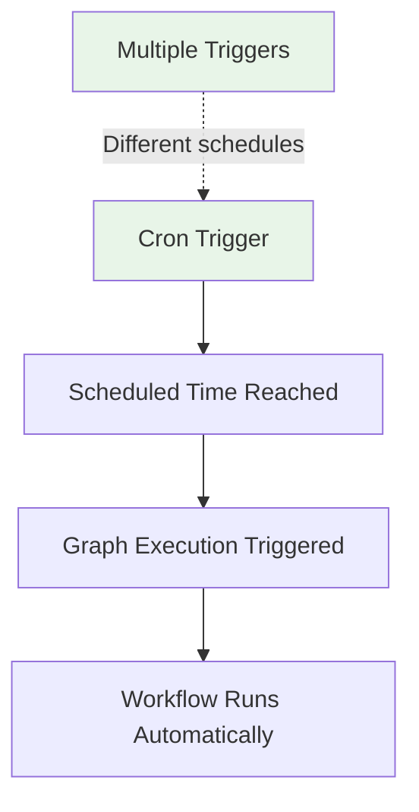

# Triggers

Triggers allow you to schedule automatic execution of your graphs using cron expressions. When a trigger is defined, Exosphere will automatically execute your graph at the specified times without requiring manual intervention.

## Overview

Triggers provide **scheduled execution** for your workflows, enabling automation for:

- **Regular data processing** (daily reports, hourly syncs)
- **Maintenance tasks** (cleanup jobs, backups)
- **Monitoring workflows** (health checks, alerts)
- **Business processes** (invoice generation, notifications)



## How Triggers Work

### Trigger Lifecycle

1. **Definition**: Triggers are defined when creating/updating a graph template
2. **Scheduling**: Exosphere schedules the next execution based on cron expression
3. **Execution**: At the scheduled time, the graph is triggered automatically
4. **Rescheduling**: After execution, the next occurrence is automatically scheduled

### Trigger Types

Currently, **CRON** is the only supported trigger type, using standard 5-field cron expressions:

```
* * * * *
│ │ │ │ │
│ │ │ │ └── Day of Week (0-7, Sunday = 0 or 7)
│ │ │ └──── Month (1-12)
│ │ └────── Day of Month (1-31)
│ └──────── Hour (0-23)
└────────── Minute (0-59)
```

## Implementation

### JSON Configuration

Define triggers in your graph template:

```json
{
  "triggers": [
    {
      "type": "CRON",
      "value": {
        "expression": "0 9 * * 1-5",
        "timezone": "America/New_York"
      }
    },
    {
      "type": "CRON",
      "value": {
        "expression": "0 0 * * 0",
        "timezone": "UTC"
      }
    }
  ],
  "nodes": [
    // ... your graph nodes
  ]
}
```

**Note:** The `timezone` field is optional and defaults to `"UTC"` if not specified. Use IANA timezone names (e.g., `"America/New_York"`, `"Europe/London"`, `"Asia/Tokyo"`).

### Python SDK Example

```python
from exospherehost import StateManager, GraphNodeModel, CronTrigger

async def create_scheduled_graph():
    state_manager = StateManager(
        namespace="DataPipeline",
        state_manager_uri=EXOSPHERE_STATE_MANAGER_URI,
        key=EXOSPHERE_API_KEY
    )
    
    # Define your graph nodes
    graph_nodes = [
        GraphNodeModel(
            node_name="DataExtractorNode",
            namespace="DataPipeline",
            identifier="extractor",
            inputs={"source": "initial"},
            next_nodes=["processor"]
        ),
        GraphNodeModel(
            node_name="DataProcessorNode",
            namespace="DataPipeline", 
            identifier="processor",
            inputs={"raw_data": "${{ extractor.outputs.data }}"},
            next_nodes=[]
        )
    ]
    
    # Define triggers for automatic execution
    triggers = [
        CronTrigger(expression="0 2 * * *", timezone="America/New_York"),  # Daily at 2:00 AM EST/EDT
        CronTrigger(expression="0 */4 * * *", timezone="UTC")              # Every 4 hours UTC
    ]
    
    # Create the graph with triggers
    result = await state_manager.upsert_graph(
        graph_name="data-pipeline",
        graph_nodes=graph_nodes,
        secrets={"api_key": "your-api-key"},
        triggers=triggers
    )
    
    print(f"Graph created with {len(triggers)} triggers")
    return result

# Run the function
import asyncio
asyncio.run(create_scheduled_graph())
```

## Common Cron Expressions

### Basic Patterns

| Expression | Description | Example Use Case |
|------------|-------------|------------------|
| `"0 9 * * 1-5"` | Every weekday at 9:00 AM | Business reports |
| `"0 */6 * * *"` | Every 6 hours | Data synchronization |
| `"0 0 * * 0"` | Every Sunday at midnight | Weekly cleanup |
| `"*/15 * * * *"` | Every 15 minutes | Health checks |
| `"0 2 * * *"` | Daily at 2:00 AM | Nightly batch jobs |
| `"0 0 1 * *"` | First day of every month | Monthly reports |

### Advanced Patterns

| Expression | Description |
|------------|-------------|
| `"0 9-17 * * 1-5"` | Every hour from 9 AM to 5 PM, weekdays only |
| `"0 0 * * 1,3,5"` | Monday, Wednesday, Friday at midnight |
| `"30 8 * * 1-5"` | Weekdays at 8:30 AM |
| `"0 12 1,15 * *"` | 1st and 15th of each month at noon |
| `"0 0 1 1,7 *"` | January 1st and July 1st at midnight |

## Best Practices

### Scheduling Considerations

1. **Avoid Peak Times**: Schedule resource-intensive workflows during off-peak hours
2. **Stagger Executions**: If you have multiple graphs, stagger their execution times
3. **Consider Time Zones**: Specify the `timezone` parameter to ensure your cron expressions run at the correct local time. If not specified, defaults to UTC.
4. **Resource Planning**: Ensure your infrastructure can handle scheduled workloads

### Error Handling

- **Retry Policies**: Combine triggers with retry policies for resilient automation
- **Monitoring**: Set up alerts for failed scheduled executions
- **Logging**: Ensure adequate logging for troubleshooting scheduled runs

### Example with Retry Policy

```python
from exospherehost import RetryPolicyModel, RetryStrategyEnum

# Define retry policy for scheduled executions
retry_policy = RetryPolicyModel(
    max_retries=3,
    strategy=RetryStrategyEnum.EXPONENTIAL,
    backoff_factor=2000,
    exponent=2
)

# Create graph with both triggers and retry policy
result = await state_manager.upsert_graph(
    graph_name="robust-pipeline",
    # Assuming `graph_nodes`, `secrets`, and `triggers` are defined as in previous examples
    graph_nodes=graph_nodes,
    secrets=secrets,
    triggers=triggers,
    retry_policy=retry_policy  # Handles failures in scheduled runs
)
```

## Timezone Support

Triggers now support specifying a timezone for cron expressions, allowing you to schedule jobs in your local timezone:

```python
# Schedule a report to run at 9 AM New York time (handles DST automatically)
CronTrigger(expression="0 9 * * 1-5", timezone="America/New_York")

# Schedule a job at 5 PM London time
CronTrigger(expression="0 17 * * *", timezone="Europe/London")

# Schedule using UTC (default)
CronTrigger(expression="0 12 * * *", timezone="UTC")
```

**Important Notes:**
- Use IANA timezone names (e.g., `"America/New_York"`, `"Europe/London"`, `"Asia/Tokyo"`)
- Timezones automatically handle Daylight Saving Time (DST) transitions
- If no timezone is specified, defaults to `"UTC"`
- All trigger times are internally stored in UTC for consistency

## Limitations

- **CRON Only**: Currently only cron-based scheduling is supported
- **No Manual Override**: Scheduled executions cannot be manually cancelled once triggered
- **Minimum Interval**: Avoid scheduling more frequently than every minute

## Next Steps

- **[Create Graph](./create-graph.md)** - Learn about graph creation
- **[Retry Policy](./retry-policy.md)** - Add resilience to scheduled executions
- **[Store](./store.md)** - Persist data across scheduled runs
- **[Dashboard](./dashboard.md)** - Monitor scheduled executions

## Related Concepts

- **[Graph Components](./graph-components.md)** - Complete overview of graph features
- **[Python SDK](./python-sdk-graph.md)** - Type-safe graph creation with triggers